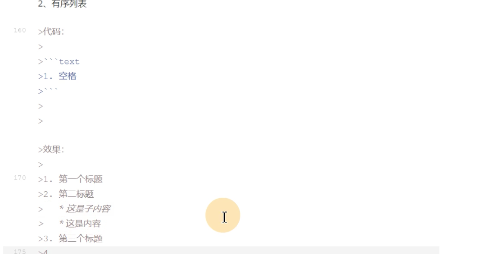

# 一、markdown简介

> markdown是一种轻量级的标记语言 理念 markdown致力于让创作或者阅读文档变得更加的容易
>
> Hyper text markup language(html)超文本标记语言

# 二、标题

1.markdown的标题

>语法: # (一级标题)  ## (二级标题)  ### (三级标题)  ......

连续回车键能去掉当前格式

> 代码: 快捷键 Option+Command+C
>
> ```
> # 这是一级标题
> ## 这是二级标题
> ### 这是三级标题
> ```
>
> 

>效果:
>
># 这是一级标题
>
>## 这是二级标题
>
>### 这是三级标题

> 快捷键:
>
> * command+数字1-5可以快速将选中文字调成对应级别的标题
> * command+ 加号/减号对标题级别进行加减

# 三、段落

1. 段落

> 语法: 直接进行文字的编辑 如果需新建下一段落可直接换行或者在段落的末尾敲空格回车 

> 代码: 
>
> ```
> 这是一个段落  
> 
> 这是一个段落
> 
> ```

> 效果
>
> 只是一个段落
>
> 这是一个段落

2. 字体

> 语法:
>
> 1. 粗体  用一对双星号**包裹  command+B
> 2. 斜体 用一对单星号*包裹  command+I
> 3. 删除线 用一对双飘号~~进行包裹 Control+Shift+`
> 4. 下滑线 用一对u标签<u></u>进行包裹 command+U

> 代码:
>
> ```
> **这是粗体**
> *这是斜体*
> ~~这是删除线~~
> <u>这是下滑线</u> 
> ```

> 效果:
>
> **这是粗体**
>
> *这是斜体*
>
> ~~这是删除线~~
>
> <u>这是下滑线</u>

3. 分割线

>语法
>
>分割线: 三个减号回车--- 

>代码
>
>```
>--- 回车
>```

>效果
>
>---
>
>

4. 脚注

>说明: 
>
>脚注是对文本进行补充说明的

>代码:
>
>```
>[^springboot]
>[^springboot]: 这是一个非常好用的框架
>```

>效果: 
>
>这是一个技术[^springboot]
>
>[^springboot]: 这是一个非常好用的框架.

# 四、列表

1. 无序列表

>代码
>
>```
>* 空格
>  回车回车清除格式
>  再打* 空格 即可实现多层级别
>
>```
>
>

>效果
>
>1、只有同一级别
>
>* 苹果
>* 香蕉
>* 橘子 
>
>2、子级别
>
>* 一级分类
>  * 二级分类
>    * 三级分类

2. 有序列表
>代码
>
>```
> 1. 空格
> ```
> 
>

>效果
>
>1. 第一个标题
>2. 第二个标题
>3. 第三个标题
>   * 这是子内容
>   * 这是子内容
>4. 第四个标题
>   * 这是子内容
>5. 这是第五个标题

# 五、区别显示

> 代码
>
> ```
> >回车
> ```
>
> 

> 效果
>
> 这是最外层区块
>
> > 这是内层
> >
> > > 这是在内层

* springboot技术

  > springboot 技术 xxxxxx

* spring cloud技术

  > spring cloud xxxxxx

# 六、代码块显示

> 代码: 
>
> ```
> ​```js/java/c#/text
> ​```js xxxx
> ```
>
> 

> 效果: 
>
> ```js
> function test(){
>   alter("Hello World!")
> }
> ```
>
> ```java
> public class Main{
>   public static void main(String[] args){
>     System.out.println("Hello World!");
>   }
> }
> ```
>
> 

# 七、链接

> 代码
>
> ```
> www.baidu.com
> [百度一下](https://www.baidu.com)
> ```
>
> 

> 效果
>
> www.baidu.com
>
> [百度一下](https://www.baidu.com)

# 八、图片插入

> 代码
>
> ```
> 
> ```
>
> 

> 效果
>
> 

# 九、表格

> 代码:  快捷键Option+Command+T
>
> ```
> |表头|表头|表头|
> |----|----|----|
> |1|2|3|
> 
> ```
>
> 

> 效果:
>
> |      |      |      |
> | ---- | ---- | ---- |
> |      |      |      |
> |      |      |      |
> |      |      |      |
>
> | 表头 | 表头 | 表头 |
> | ---- | ---- | ---- |
> | 1    | 2    | 3    |

# 十、其他

>代码: 
>
>```
><kbd></kbd>
>`ctrl`+`shift`+`esc`查看任务管理器 
>```
>
>

>效果: 
>
><kbd>Ctrl</kbd>
>
>`ctrl`+`shift`+`esc` 查看任务管理器
>
>

>

